<!--
  Built by the scripts in this repo - do not hand-edit.

    pip install -r requirements.txt
    python scripts/gen_portrait.py --photo assets/portrait-source.jpg
    python scripts/gen_info_card.py
    python scripts/gen_stack.py
    python scripts/gen_signals.py
    python scripts/fetch_contributions.py --user saurav158204
    python scripts/fetch_profile.py --user saurav158204
    python scripts/gen_heatmap.py
    python scripts/gen_stats.py
    python scripts/verify_svgs.py
    python scripts/gen_readme.py

  STATIC=1 on either generator emits a frozen final frame, which is what you
  want when previewing - an animation that has already finished looks like an
  empty panel. The heatmap refreshes itself daily via .github/workflows.
-->

 

  

<table>
<tr>
<td valign="top"></td>
<td valign="top"></td>
</tr>
</table>

---

## About Me

Hi, I'm **Saurav** — a mechanical engineering student at **Army Institute of Technology, Pune**,
working as a software engineer in practice. I build things that use language models to do
something genuinely useful, and I care about the part most demos skip: making them reliable
enough that an ordinary person can actually depend on them.

- 🧠 **Generative AI & LLM applications** — RAG pipelines, AI agents, prompt engineering, fine-tuning
- 🎨 **Frontend that keeps up** — React.js, Next.js, TypeScript and Tailwind, because a good model behind a bad interface still fails the user
- 🛡️ **Joint Secretary, ISDF Club** — running CTFs, workshops and security sessions for 300+ students
- 📈 **100+ LeetCode problems**, 2× Smart India Hackathon, 2nd Runner-Up at TRYST'26, IIT Delhi
- 💬 Ask me about **LLM apps, RAG, and getting AI out of the notebook and into production**

---

## Tech Stack

 

  

**Generative AI** &nbsp;·&nbsp; LangChain &nbsp;·&nbsp; LlamaIndex &nbsp;·&nbsp; Hugging Face &nbsp;·&nbsp; OpenAI APIs &nbsp;·&nbsp; RAG &nbsp;·&nbsp; Vector Databases &nbsp;·&nbsp; Fine-Tuning

**Data &amp; ML** &nbsp;·&nbsp; Scikit-learn &nbsp;·&nbsp; TensorFlow &nbsp;·&nbsp; Pandas &nbsp;·&nbsp; NumPy

---

## GitHub Stats

<!--
  github-readme-stats.vercel.app is deliberately not used here: its public
  instance was returning broken images when this was built. The summary cards
  and streak card below cover the same ground and were verified working.
-->

  

  

  

---

## Contribution Calendar

  

---

## Signals

---

## 🚀 Featured Projects

- **Predictive Maintenance &amp; Factory Analytics Platform**
   
  
  
  
   
  ETL pipelines over industrial sensor data, SQL databases for machine-health records, automated
  reporting and dashboards that turned equipment trends into decisions people actually acted on.

- **News Aggregator &amp; Sentiment API**
   
  
  
  
  
   
  Scrapes live articles across sources with inconsistent markup, normalises them into
  schema-compliant JSON, tags sentiment with Scikit-learn, and exposes REST endpoints that
  query by keyword, source, date range and sentiment — including the malformed-HTML edge cases.

- **Upcoming: RAG-backed knowledge assistant**
   
  
  
  
   
  Retrieval over private documents with citations, an agent loop for multi-step questions,
  and a frontend that makes the retrieval visible instead of hiding it.

---

## Leadership &amp; Involvement

- **Joint Secretary** — Information Security &amp; Digital Forensics Club (ISDF), AIT Pune
- Organised CTFs, technical workshops and cybersecurity events for **300+ students**
- Coordinated guest lectures and technical sessions with faculty, alumni and industry experts
- **2× Smart India Hackathon** participant (Software Edition) · **2nd Runner-Up, TRYST'26**, IIT Delhi

---

## Fun Facts

- Mechanical engineering taught me systems thinking; software is where I apply it
- I'd rather ship a small thing that works than demo a big thing that doesn't
- Always up for a hackathon, a CTF, or an argument about retrieval quality
- Currently obsessed with making LLM apps behave predictably enough to trust

---

### Let's connect

<!-- Add your LinkedIn and LeetCode URLs below, then re-run gen_readme.py -->

  

<i>Built with Python — every panel above the stat cards is generated and verified by the scripts in this repo.</i>

